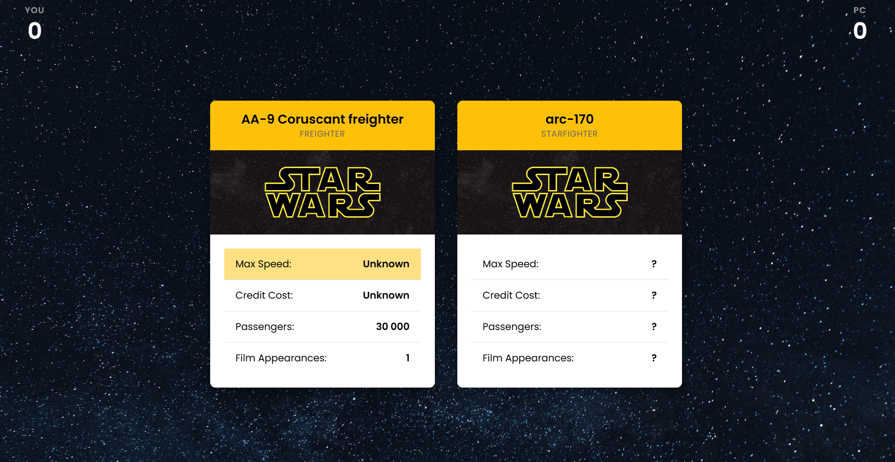
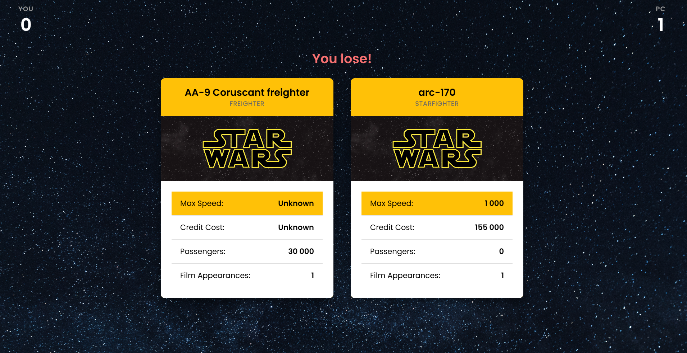

# Starship Battle

draft description

## Approach

### App Navigation & Structure

- Main screens: `GameStartScreen`, `GameView`, and `GameOverScreen` are located in the `src/screens` directory.

- Reusable UI components are in the `src/components` directory, including `Board`, `Card`, `ScoreDisplay` etc.

- Game logic is encapsulated in a custom hook `useStarWarsGame` in the `src/hooks` directory.

- API service functions are in `src/services/swapi.ts`.

- Type definitions are in `src/types`, utilities in `src/utils`, game messages in `src/constants`, and styling tokens in `src/styles`.

### Technical Approach

- **useStarWarsGame hook** manages all game state including scores, cards, selected category, loading states, and game flow.
- **Starship deck system** fetches all starships from the SWAPI once on game initialization and maintains a shuffled deck to ensure no duplicate cards during gameplay.
- **Each card** displays starship name, class, and clickable categories (max speed, cost, passengers, films count).
- **Responsive design** with cards stacking vertically on mobile and displaying side-by-side on tablet/desktop.
- **Game flow** includes:
  - Starting a new game from the welcome screen.
  - Selecting a category to compare values between user and computer cards.
  - Viewing win/lose/draw results with score updates.
  - Automatically loading a new card for the winner to continue the round.
  - Ending the game when the deck is exhausted with a game over screen.
  - Restarting the game with a freshly shuffled deck.
- **Accessibility** features include semantic HTML, keyboard navigation support, and ARIA labels.

